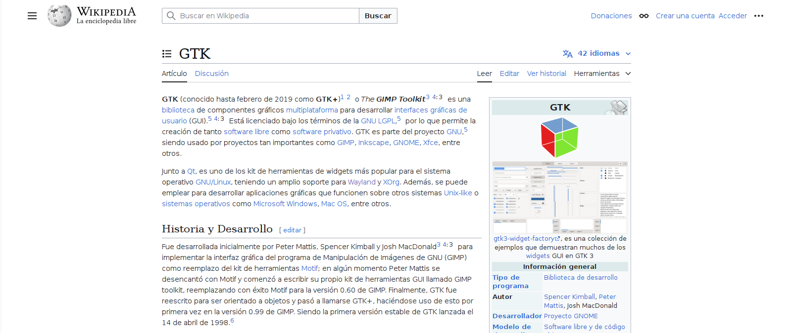
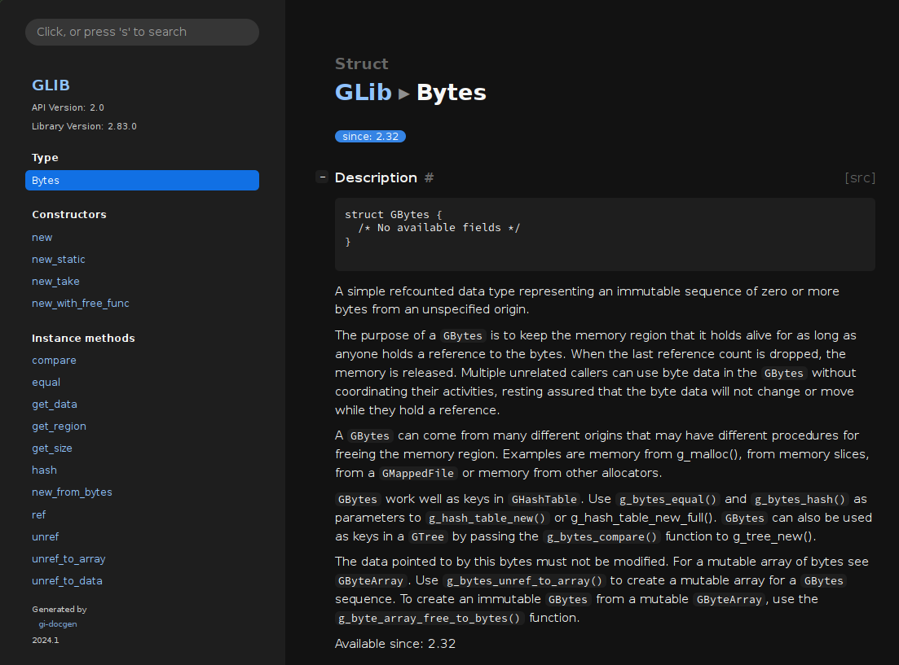
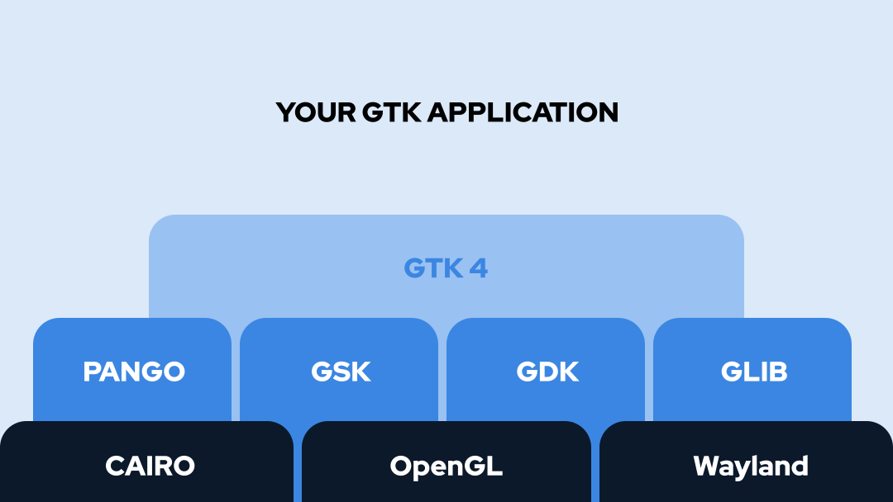

# ¿Qué es GTK?

- GTK es una tecnología para hacer aplicaciones gráficas
- GTK es libre (LGPL) y portable (X11, Wayland, Windows, macOS, web)
- GTK se puede usar desde una multitud de lenguajes de programación



# Portabilidad

- GTK está escrito en C para ser fácil de portar
- Cualquier lenguaje de programación con soporte para funciones externas admite GTK
- Bindings más importantes: gtkmm, pygobject, gjs, gtk-rs.
- Vala.

# Funcionamiento técnico

::: columns

:::: column

## GTK es orientado a objetos

- Hay **clases** (`Window`, `Button`, `Label`...)
- Las clases tienen **métodos** (`set_visible`, `destroy`, `open_file`...)
- También hay **atributos**, **callbacks**, **propiedades**...

::::

:::: column

## Esto incluye C.

- GTK está hecho por encima de **GObject**, un framework de orientación a objetos para C.
- Hay más tecnologías de GObject: GLib, GIO...
- Otros lenguajes usan lo que más se le parezca

::::

:::

# GObject (1/6)

## Sistema de tipos

- **Espacios de nombres**: organizan clases. `Gtk`, `GLib`, `Pango`, `Adw`...
- **Clases**: representan clases. Incluyen herencia, interfaces...
- **Tipo**: representa clases, interfaces, uniones, estructuras...
- **Señales**: representan eventos (útil para crear callbacks).

---

# GObject (2/6)

## Adaptación a cada lenguaje

- Se extrae el sistema de tipos del lenguaje de programación en el que se escribe la biblioteca (p.ej., C).
- Se fabrica un esquema de datos que describe los elementos de la API (preferentemente .typelib)
- Con ese esquema luego se puede fabricar un binding para cada lenguaje.
  - En tiempo de ejecución / compilación si el runtime lo soporta (por ejemplo, Python, JavaScript).
  - Pre-generar código fuente en otro lenguaje de programación (por ejemplo, Rust).

---

# GObject (3/6)

## docs.gtk.org



---

# GObject (4/6)

## Simplificación de C

```c
struct app_document {
    app_parent parent_type;

    char *filename;
    guint cursor_line;
    guint cursor_column;
};

app_document *app_document_new();
void app_document_free(app_document *document);
void app_document_open(app_document *document, char *path);
void app_document_goto(app_document *document, guint line, guint col);
```

---

# GObject (5/6)

## Cosas que aporta GObject a C

- Sistema de tipos.
- Representación de la orientación a objetos.
- Gestor de memoria propio con soporte para smart pointers y weak pointers.

---

# GObject (6/6)

## Otros lenguajes

- Mediante introspección se puede crear un binding de una API de GObject en un lenguaje.
- Cada lenguaje interpreta un tipo de GObject según la semántica de su lenguaje.
- Si el lenguaje es orientado a objetos, ese sistema de tipos podría ser nativo.
- Si el lenguaje no es orientado a objetos, lo adaptará como pueda.

# GTK

- GTK es una biblioteca hecha por encima de GObject.
- Incorpora una serie de `Widget`s para describir los elementos de una interfaz.
- Los widgets tienen propiedades (título, texto, tooltip...)
- Los widgets tienen señales y eventos (clicked, changed...)

# Stack tecnológico de una aplicación GTK

## Resumen (<https://www.gtk.org/docs/architecture/>)

{height=50%}

---

# Stack tecnológico de una aplicación GTK

## Componentes más habituales

- GObject: framework de orientación a objetos y sistema de tipos.
- GLib: biblioteca estandar con estructuras de datos, colecciones, hilos...
- GIO: biblioteca de entrada y salida (archivos, conexión de red, settings, IPC...)

## Componentes gráficos más habituales

- GDK y GSK: capas intermedias que permiten simplificar GTK.
- Pango: biblioteca para trabajar con tipografía.
- Cairo: biblioteca para trabajar con gráficos.

---

# Stack tecnológico de una aplicación GTK

## Componentes extra para una aplicación gráfica

- Libadwaita: conjunto extra de componentes gráficos que siguen la HIG de GNOME.

- WebKitGTK: navegadores web.
- Libsoup: cliente HTTP.
- VTE: consolas y terminales.
- GtkSourceView: editores de código fuente.
- Shumate: mapas.

# ¿Por qué elegir GTK?

- Aplicación nativa: no hace falta empaquetar un navegador web.
- Iteración rápida durante el desarrollo.
- Integración con el estilo de cada plataforma. (Al menos en X11 y Wayland).

(Bajo mi punto de vista, consulte siempre con su farmacéutico.)

# GTK frente a Qt

- Ambas tienen bindings para otros lenguajes de programación.
- Ambas tienen su propio conjunto de widgets.
- Ambas son multiplataformas.
- Qt siempre ha tenido un modelo de licencias un poco peculiar.
- GTK es LGPL.

(Bajo mi punto de vista, consulte siempre con su farmacéutico.)

# Componentes de una aplicación GTK

- Application
- Window
- Widget
- Button
- Label
- Entry
- Container
- Box
